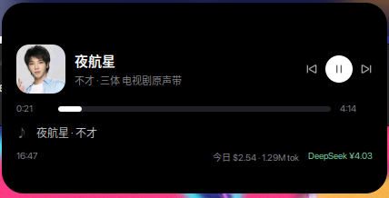

# Desktop Stickers (Frosted Glass)

**简体中文** · [English](README.en.md)

A GTK4 desktop widget set: **11 independent frosted-glass stickers** — borderless,
individually draggable, live system status. Plus a **top-bar lyrics plugin** that
shows the current lyric line while music is playing.

Project page: <https://github.com/KDSheRick/desktop-stickers>


## Stickers

| Sticker | Shows |
| --- | --- |
| 🕐 Clock | Time (seconds) + date / weekday |
| ⚙️ CPU | Usage ring, temperature, frequency (green → yellow → red) |
| 🧠 Memory | Usage ring, used / total, swap |
| 💾 Disk `/` | Usage bar, used / total, free space |
| 🌐 Network | Live download / upload rate + 40s dual-color sparkline |
| 🔋 Battery | Level bar, remaining time, ⚡ when charging |
| 🌡️ Temp / Fan | CPU temperature ring + fan speed |
| 🖥️ System | Hostname, distro, kernel, uptime, load (wide, two columns) |
| 🎵 Music | Cover art, title / artist, progress bar, **prev / play-pause / next**; bar is **clickable & draggable to seek** |
| 📄 Recent files | Frequently & recently opened files (two columns): double-click to open, right-click for more |
| 📊 Process Top 3 | Top CPU consumers with CPU + memory columns |
| 🔌 API usage | OpenCode spend & tokens (today / total) + provider API balances (configurable) |

Layout: system monitors on the left, music / files / processes on the right —
both panels share the same width and are anchored to the screen corners.

## Requirements

- Ubuntu / GNOME with GTK 4.16+ (tested on Ubuntu 26.04, GNOME 50)
- `python3-gi`, `gir1.2-gtk-4.0`, `python3-psutil` (preinstalled on Ubuntu)
- Optional: `python3-pil` (rounded cover icons), `blur-my-shell` extension for real blur

## One-click install

```bash
git clone https://github.com/KDSheRick/desktop-stickers.git
cd desktop-stickers
bash install.sh
```

The script checks dependencies, adds autostart, creates app-menu shortcuts
(Stickers / Lyrics / Settings), starts everything, and enables real background
blur if the GNOME Rounded Blur library is present.

```bash
bash install.sh --remove   # remove autostart + menu shortcuts
```

## Run

```bash
cd desktop-stickers
python3 main.py
```

Drag any sticker to move it (positions are remembered). Right-click any sticker for
the menu: reset layout / toggle dark-light / toggle the top-bar lyrics / **settings** / quit.

## Settings controller

Open it from **any sticker's right-click menu → 贴纸设置…**, or search for
"贴纸设置" (Sticker Settings) in the app menu:

| Option | Range | Notes |
| --- | --- | --- |
| Card width | 110–260 | wide cards (clock / system / right column) stay two columns wide |
| Corner radius | 0–40 | automatically syncs Blur my Shell's corner radius (radius + 9) so inner/outer corners stay concentric |
| Glass opacity | 0.15–0.98 | dark glass opacity (light glass uses +0.13) |
| Card gap / screen margins | — | position of the whole layout |
| Dark glass / Top-bar lyrics | switches | theme and plugin toggles |
| Reset positions | button | clears drag memory and re-applies the layout |

Changes apply **live** (written to `~/.config/sysstickers/settings.json`; the running
app watches the file), no restart needed. Individual stickers can still be dragged
for fine-tuning.

## Top-bar lyrics (standalone plugin)

```bash
python3 lyrics_tray.py --status   # running / stopped
python3 lyrics_tray.py --start    # enable
python3 lyrics_tray.py --stop     # disable
python3 lyrics_tray.py --toggle   # switch
```

- Shows the current lyric line next to the album cover in the GNOME top bar
- Click the tray item to play/pause; right-click for play/pause, prev, next, close
- Lyrics from NetEase Cloud Music (fallback: [lrclib.net](https://lrclib.net));
  fetched once per track and cached in `~/.cache/sysstickers/lyrics/`
- The on/off state is remembered and respected by autostart
- Requires Ubuntu's `ubuntu-appindicators` extension (enabled by default)

## Dynamic Island (GNOME Shell extension)

> Branch `feature/dynamic-island`: a macOS Dynamic Island–style capsule at the top.



A pure-black capsule centered at the top: **hover to expand, move away → collapses after
~1.5 s, click to pin it open**.

- Collapsed: time when idle; while playing it becomes a **long capsule** with the
  current lyric scrolling inside it; paused shrinks back to the small pill
  (cover + static EQ bars)
- **Notifications**: a new notification auto-expands the island into a card
  (icon + title/app + body) for 5 seconds, then it collapses back; multiple
  notifications are queued one by one; clicking the card opens the notification
  center; hovering pauses the countdown
  - To show them *only* in the island (no GNOME banners):
    `gsettings set org.gnome.desktop.notifications show-banners false`
- Expanded (playing): cover / title / artist / draggable progress bar / prev · play · next /
  current lyric
- Expanded (idle): large clock + date, today's cost / tokens / total, 7-day mini bar chart
  and provider balances

### Install

```bash
bash island-panel/install-island.sh          # install & enable (log out once on first install)
bash island-panel/install-island.sh --remove # uninstall (the system clock comes back)
```

### Toggling

- **Extensions app** (Activities → "Extensions"): toggle "Dynamic Island"
- Command line:

  ```bash
  gnome-extensions disable lyrics-panel@loong   # disable (clock returns instantly)
  gnome-extensions enable  lyrics-panel@loong   # enable
  ```

### Notes

- Drawn in the top bar center: **hides the system clock** while enabled; clicking the time
  opens the calendar / notifications
- Clutter animations, floats above all windows, follows the panel layout
- Why the one-time logout: GNOME 45+ imports an extension module only once per shell
  process. The extension ships a tiny loader, so afterwards you can hot-reload changes to
  `island.js` / `media.js` / `usage.js` / `stylesheet.css` with
  `gnome-extensions disable/enable lyrics-panel@loong`; only `extension.js` (the entry)
  needs another logout
- The uuid stays `lyrics-panel@loong` (an in-place upgrade of the old lyrics extension)
- Data comes from the Python helpers: the installer copies `api_usage.py` and `settings.py`
  into the extension dir and the extension runs `python3 api_usage.py --json` once a minute
  (balances are cached on disk for 10 minutes)

> **Island missing after login?** Check GNOME's global user-extension switch:
> `gsettings get org.gnome.shell disable-user-extensions` should be `false` (when it is
> `true`, *no* third-party extension loads). `gnome-extensions info lyrics-panel@loong`
> should report the state as `ACTIVE`.

## Autostart & blur

```bash
bash install-autostart.sh          # stickers / lyrics / island: startup + app menu entries
bash enable-blur.sh                # real background blur (needs GNOME Rounded Blur)
bash tools/gnome-rounded-blur/rounded_blur_build.sh -i   # install that library (sudo)
```

## Customization

Prefer the [settings controller](#settings-controller); for finer tweaks you can still
edit the constants:

| What | Where |
| --- | --- |
| Card width / radius / opacity / gap | the controller, or `settings.py` → `DEFAULTS` |
| Cover size / buttons | `widgets.py`: `MUSIC_COVER` / `PLAY_SIZE` / `SKIP_SIZE` |
| Margins | `main.py`: `WINDOW_MARGIN` |
| Colors, fonts | `style.css` |
| Top-bar lyrics width | `lyrics_tray.py`: `MAX_CELLS` |

> Note: if you change the card corner radius in `style.css`, also set the
> Blur my Shell `applications corner-radius` to `card radius + 9` (run `enable-blur.sh`),
> so the blur outline stays concentric with the card.

## API usage card

The card shows:

- **Today's spend** (large) with today's tokens / replies and input / output / cache split
- A **7-day spend mini bar chart** (today highlighted)
- **Total spend** and tokens
- **Provider balances** (anchored at the bottom)

Data comes from two sources:

- **OpenCode usage**: today / total **spend** and **tokens**, read locally from
  `~/.local/share/opencode/opencode.db` (no network)
- **Provider balances**: queries each configured provider's balance endpoint
  (DeepSeek by default — **nothing is hardcoded to a vendor**)

### Configure providers

Settings file: `~/.config/sysstickers/settings.json`

Built-in presets: `deepseek`, `moonshot`, `siliconflow`

```json
{ "api_providers": ["deepseek", "moonshot"] }
```

Any other vendor via `api_custom` (example endpoint returning
`{"data":{"credit":12.5,"unit":"CNY"}}`):

```json
{
  "api_custom": [
    {
      "id": "myprovider",
      "label": "My Provider",
      "url": "https://api.example.com/v1/balance",
      "json_path": "data.credit",
      "currency_path": "data.unit"
    }
  ]
}
```

API keys are resolved in this order: `api_keys` in settings (optional) →
**OpenCode credential store** (read automatically) → environment variable
`<ID>_API_KEY` (e.g. `MOONSHOT_API_KEY`).

> Balances refresh every **10 minutes**; failures show `—` with the error in the
> tooltip. Remove a provider from `api_providers` to hide it.

## Styling & custom GTK themes

The stickers are entirely styled by `style.css`. One catch worth knowing:

Third-party GTK themes (MacTahoe, Orchis, …) ship a user stylesheet at
`~/.config/gtk-4.0/gtk.css`, loaded at the **USER priority**. It overrides *generic*
selectors such as `window`, `.card` and `button`, which makes the stickers look wrong:

- card backgrounds pick up the theme's colors instead of the glass design
- buttons fall back to the theme's default look (square corners, dated icons)
- custom classes like `.clock-time` are unaffected — so it looks inconsistent,
  and is hard to debug

The app therefore loads its own `style.css` at **USER + 1** priority
(see `_load_css` in `main.py`), so the stickers always render as designed,
no matter which theme is installed.

> Want to follow the theme instead? Write your overrides at USER+2 or higher,
> or simply edit `style.css` in this project.

## License

MIT — see [LICENSE](LICENSE).
`tools/gnome-rounded-blur/` is third-party code under GPL-3.0 (see its README).
