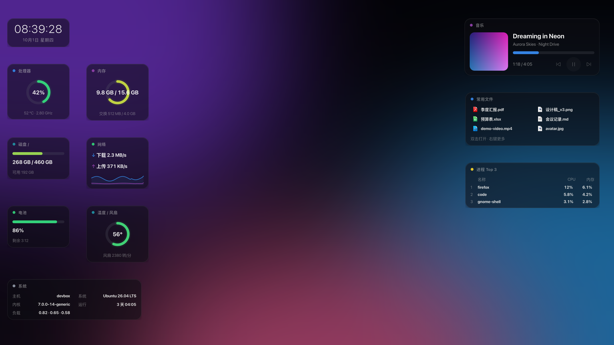

# 桌面系统贴纸（毛玻璃）

[English](README.en.md) · **简体中文**

用 GTK4 写的桌面小组件：**11 张独立的毛玻璃贴纸**，无边框、可单独拖动，实时显示系统状态。
左侧 8 张系统监控（含温度风扇、系统信息宽卡）+ 右侧 3 张（音乐 / 常用文件 / 进程），
每张贴纸是一个独立的圆角玻璃窗口，配合 GNOME 的 **Blur my Shell** 扩展，背后是真正被模糊的桌面背景。
另有**顶栏歌词插件**：可单独开关，播放音乐时在 GNOME 顶栏显示当前歌词句。

项目主页：<https://github.com/KDSheRick/desktop-stickers>




## 贴纸一览

| 贴纸 | 内容 |
| --- | --- |
| 🕐 时钟 | 时间（秒级）+ 日期、星期 |
| ⚙️ 处理器 | 占用率圆环、温度、频率（圆环颜色随负载绿→黄→红） |
| 🧠 内存 | 占用率圆环、已用/总量、交换分区 |
| 💾 磁盘 / | 占用进度条、已用/总量、可用空间 |
| 🌐 网络 | 下载/上传实时速率 + 最近 40 秒双色迷你折线 |
| 🔋 电池 | 电量进度条、剩余时间；充电时显示 ⚡ |
| 🌡️ 温度 / 风扇 | CPU 温度圆环（绿→黄→红）+ 风扇转速 |
| 🖥️ 系统 | 主机名、系统版本、内核、运行时长、负载（宽卡，两列） |
| 🎵 音乐 | 大封面 + 歌曲 / 歌手 / 进度条 + **上一曲 / 播放暂停 / 下一曲**；进度条可**点击 / 拖动定位** |
| 📄 常用文件 | **最近经常打开的文件**（两列）：双击打开；右键打开 / 在文件管理器中显示 / 复制路径 |
| 📊 进程 Top 3 | 本时段 CPU 占用最高的 3 个进程（名称 + CPU + 内存） |
| 🔌 API 用量 | OpenCode 今日 / 累计花费与 token + 各厂商 API 余额（厂商可配置） |

## 布局

- 左侧 7 张默认排布在**屏幕左上角**（避开 GNOME 顶栏），自上而下：
  - 时钟（宽卡，横跨两列）
  - 处理器 / 内存
  - 磁盘 / 网络
  - 电池 / 温度风扇
  - 系统（宽卡，两列信息）
  - 同一行的两张贴纸高度自动对齐
- 右侧 4 张默认排布在**屏幕右上角**，与左侧顶部对齐：
  音乐（大封面）、常用文件（两列）、进程 Top 3、API 用量——**四张同宽**，
  宽度与左侧时钟 / 系统卡一致，左右两个面板等宽、镜像平衡
- 每张贴纸都可以**单独拖动**，位置单独记忆，下次启动精确恢复
- 右键 → 「复位全部贴纸」一键把左右两列排回默认位置

## 一键安装（推荐）

```bash
git clone https://github.com/KDSheRick/desktop-stickers.git
cd desktop-stickers
bash install.sh
```

脚本会自动完成：**依赖检查 → 加入开机自启 → 创建应用菜单快捷方式（贴纸 / 顶栏歌词 / 贴纸设置）
→ 启动贴纸与顶栏歌词 → 若已安装 GNOME Rounded Blur 库则自动开启背景模糊**。

```bash
bash install.sh --remove   # 卸载（自启动与菜单快捷方式）
```

## 运行

依赖系统自带的组件（Ubuntu 已预装，无需 pip / 无需 root）：

- `python3`（>= 3.10）
- `python3-gi` + `gir1.2-gtk-4.0`（GTK 4.16+，本机为 4.22）
- `python3-psutil`
- `python3-pil`（可选：封面圆角与占位图标；没有时会自动降级为不带圆角的版本）

```bash
cd desktop-stickers
python3 main.py
```

> 实现说明：GNOME 的 Wayland 协议不允许应用自行移动窗口，因此程序默认通过
> **XWayland（X11 后端）** 运行来实现逐张贴纸定位与记忆。想强制原生 Wayland：
> `STICKERS_BACKEND=wayland python3 main.py`（此时退化为单窗面板，位置由桌面环境决定）。
> 你的显示器是整数倍缩放，XWayland 下渲染同样清晰。

## 圆角（倒角）与样式

- 卡片圆角：`style.css` 中 `.card` 的 `border-radius`（默认 **16px**，可自由调大/调小）
- 卡片外还有 9px 的透明留白（`main.py` 的 `WINDOW_MARGIN`），用来显示阴影
- 阴影、透明度、描边都在 `style.css`（`.dark .card` / `.light .card`）

> **为什么没有开背景模糊？** 本机 GNOME Shell 50 的原生模糊（`ShellBlurEffect`）不支持圆角，
> 而系统对窗口的模糊区域是按"窗口矩形"裁剪的 —— 一旦开启模糊，贴纸外圈就会出现直角毛边。
> 之前的处理是关闭贴纸的模糊，改用半透明玻璃卡片，保证边缘是干净的圆角。
> 想要"模糊 + 圆角"两者兼得，见下文「毛玻璃（可选）：完整启用步骤」。

## 毛玻璃（可选）：完整启用步骤

贴纸默认是「干净圆角 + 半透明玻璃」样式。想同时拥有 **实时背景模糊 + 圆角**，
需要安装 Blur my Shell 官方推荐的 GNOME Rounded Blur 库
（原因：GNOME Shell 50 的原生模糊 `ShellBlurEffect` 没有圆角能力，开启模糊时外圈必然是直角）。

### 1. 安装库（需要 sudo，约 1~2 分钟）

官方安装命令使用的是 `raw.githubusercontent.com`（本机网络会重置该域名，无法直接访问），
因此安装脚本已经通过 GitHub API 下载到了项目目录，直接本地执行即可：

```bash
cd /tmp
bash ~/desktop-stickers/tools/gnome-rounded-blur/rounded_blur_build.sh -i
```

脚本会自动检测 mutter 版本、安装编译依赖（apt）、克隆并编译安装库。
**每次 GNOME 大版本更新后需要重新执行一次**（因为要针对新版本重新编译）。

### 2. 注销并重新登录

让 GNOME Shell 重新加载扩展（从而加载新安装的库）。
贴纸应用已配置开机自启（`bash install-autostart.sh --remove` 可取消），会自己回来。

### 3. 开启模糊（一条命令）

```bash
bash ~/desktop-stickers/enable-blur.sh
```

- 开启后：贴纸 = 实时毛玻璃 + 圆角
- 关闭（回到当前干净样式）：`bash enable-blur.sh --disable`
- 圆角参数：脚本会设 `applications corner-radius = 25`（= 卡片圆角 16 + 窗口留白 9，
  两者同心、边缘宽度均匀）。若修改了 `style.css` 的圆角或 `main.py` 的 `WINDOW_MARGIN`，
  建议把该值同步改为两者之和

## 控制器：实时调整外观

从**任意贴纸右键菜单 →「贴纸设置…」**，或应用菜单搜索「贴纸设置」打开控制器：

| 可调项 | 范围 | 说明 |
| --- | --- | --- |
| 卡片宽度 | 110–260 | 宽卡（时钟 / 系统 / 右列）自动保持两列宽 |
| 圆角 | 0–40 | 同时**自动同步 Blur my Shell 的模糊圆角**（圆角 + 9），保持内外同心 |
| 玻璃不透明度 | 0.15–0.98 | 深色玻璃的不透明度（浅色玻璃自动 +0.13） |
| 卡片间距 / 屏幕边距 | 0–80 / 0–300 | 整组贴纸的排布位置 |
| 深色玻璃 / 顶栏歌词 | 开关 | 主题切换与歌词插件开关 |
| 复位贴纸位置 | 按钮 | 清空拖动记忆，回到默认排布 |

所有改动**实时生效**（设置写在 `~/.config/sysstickers/settings.json`，主程序监听文件并立即应用），
不需要重启；单独拖动某张贴纸依然可以微调它自己的位置。

## 尺寸调整

优先用[控制器](#控制器实时调整外观)；想改更细的参数（代码里的常量）也可以：

| 想改什么 | 改哪里 |
| --- | --- |
| 卡片宽度 / 圆角 / 不透明度 / 间距 | 控制器，或 `settings.py` 的 `DEFAULTS` |
| 圆环大小 / 折线高度 | `widgets.py` 中 `RING_SIZE` / `SPARK_HEIGHT` |
| 音乐卡封面 / 按钮大小 | `widgets.py` 中 `MUSIC_COVER` / `PLAY_SIZE` / `SKIP_SIZE` |
| 阴影留白（窗口内边距） | `main.py` 顶部 `WINDOW_MARGIN` |
| 右侧贴纸的显示与顺序 | `main.py` 顶部 `RIGHT_COLUMN`（默认音乐/常用文件/进程） |
| 顶栏歌词最长宽度 | `lyrics_tray.py` 的 `MAX_CELLS` |
| 字号、内边距、颜色细节 | `style.css` |

> 刷新间隔：`main.py` 的 `REFRESH_INTERVAL_MS`（毫秒）

## 交互

- **拖动**：按住任意贴纸空白处拖动，移动这一张贴纸
- **右键菜单**：复位全部贴纸 / 切换深浅玻璃 / 退出
- **常用文件**（最近经常打开的文件，数据来自 GTK 的「最近使用」记录）：
  - **双击**一行 → 用默认程序打开该文件
  - **右键一行** → 打开 / 在文件管理器中显示 / 复制路径
  - 列表按「打开次数 + 近期加权」排序；文件不存在时自动隐藏
- **音乐卡**：播放器（Firefox、Rhythmbox 等支持 MPRIS 的都行）开始播放后自动显示；
  显示封面、歌曲、歌手 / 专辑、进度与时间
  - **上一曲 / 播放暂停 / 下一曲** 三个按钮（右侧）；播放器不支持切歌时自动置灰
  - **进度条可点击 / 拖动** → 定位到指定位置（无需打开播放器窗口）
- **顶栏歌词**（见下文）：显示在顶栏托盘区，单击图标切换播放/暂停，右键菜单可切歌、关闭；
  贴纸右键菜单里也有「顶栏歌词」开关
- 再次运行 `python3 main.py` 不会开出新窗口（单实例）
- 圆环与进度条颜色随负载变化：绿 → 黄（≥45%）→ 红（≥90%）

## 顶栏歌词（独立插件）

顶栏歌词是一个可以**单独开关的插件**（`lyrics_tray.py`，与贴纸主程序相互独立）。
播放音乐时，当前歌词句会显示在 **GNOME 顶栏**（托盘区域，时钟右侧）：

- 每 250ms 跟随播放进度滚动；暂停时定格；没有播放内容时自动隐藏
- 图标是**专辑封面缩略图**（圆角），后面直接跟当前歌词句，没有多余符号：
  封面优先用播放器提供的，其次从网易云搜索结果取；都没有时显示程序生成的占位音符
- **单击**托盘里的音符图标 = 播放 / 暂停；
  **右键菜单** = 播放 / 暂停、上一首、下一首、关闭顶栏歌词
- 歌词来源：**网易云音乐优先**，找不到时用 [lrclib.net](https://lrclib.net) 兜底；
  结果按「歌名 + 歌手」匹配，原唱优先（避开翻唱/cover），并过滤作词作曲等制作人员行
- 歌词缓存在 `~/.cache/sysstickers/lyrics/`，同一首歌不会重复请求
- 原理：插件注册 StatusNotifierItem + Ayatana 文字标签，由 Ubuntu 自带的
  `ubuntu-appindicators` 扩展渲染，所以**不需要装 Shell 扩展、也不用注销**

### 开关方式（状态会被记住，重启后保持）

1. **任意贴纸右键菜单 →「顶栏歌词」**：打勾 = 已开启，点一下切换
2. **应用菜单（GNOME 活动 → 搜索"顶栏歌词"）**：点击即开/关切换
3. 命令行：

   ```bash
   python3 lyrics_tray.py --status   # 查看状态（running / stopped）
   python3 lyrics_tray.py --start    # 打开
   python3 lyrics_tray.py --stop     # 关闭
   python3 lyrics_tray.py --toggle   # 切换
   ```

开关状态保存在 `~/.config/sysstickers/lyrics-tray.json`；开机自启会读取该状态，
**关掉之后重启系统也不会自己回来**。插件日志在 `~/.cache/sysstickers/lyrics-tray.log`。

> 另外 `lyrics-panel/` 目录里有一个**原生顶栏文字扩展（实验性）**（无托盘图标，显示在左侧
> Activities 旁）：`bash lyrics-panel/install-lyrics-panel.sh` 安装后需要**注销重新登录**一次
> 才会加载。两种方式二选一即可，一般推荐上面的插件方案。

## 毛玻璃效果说明

- 每张贴纸窗口的透明度、圆角、阴影、描边都在 `style.css` 调整
- 背景模糊（毛玻璃）目前**关闭**（原因见上文「圆角」一节），贴纸是"半透明玻璃"观感
- 若已安装 GNOME Rounded Blur 库并想开启模糊，把白名单加回来即可：
  ```bash
  DIR=~/.local/share/gnome-shell/extensions/blur-my-shell@aunetx/schemas
  S=org.gnome.shell.extensions.blur-my-shell
  GSETTINGS_SCHEMA_DIR=$DIR gsettings set $S.applications whitelist "['*SysStickers*','*sysstickers*']"
  ```

## API 用量卡片

右侧「API 用量」卡片显示两类信息：

- **OpenCode 用量**：今日 / 累计的**花费**与 **token** 数
  （读本地数据库 `~/.local/share/opencode/opencode.db` 的会话统计，不联网）
- **各厂商余额**：按配置查询各家的余额接口（默认 DeepSeek，**不写死任何厂商**）

### 配置厂商

设置文件：`~/.config/sysstickers/settings.json`

内置预设：`deepseek`、`moonshot`、`siliconflow`

```json
{ "api_providers": ["deepseek", "moonshot"] }
```

任意其他厂商用 `api_custom` 自定义（示例：接口返回 `{"data":{"credit":12.5,"unit":"CNY"}}`）：

```json
{
  "api_custom": [
    {
      "id": "myprovider",
      "label": "我的厂商",
      "url": "https://api.example.com/v1/balance",
      "json_path": "data.credit",
      "currency_path": "data.unit"
    }
  ]
}
```

Key 的查找顺序：`api_keys`（写死在设置里，可选）→ **OpenCode 凭据库**（自动读取，通常不用配）
→ 环境变量 `<ID>_API_KEY`（如 `MOONSHOT_API_KEY`）。

> 余额默认 **10 分钟**查一次（避免频繁请求接口）；查不到时显示「—」，鼠标悬停可看错误原因；
> 不想显示某厂商，把它从 `api_providers` 里删掉即可。实测：DeepSeek 余额可正常读取。

## 样式与自定义 GTK 主题

贴纸的外观全部由 `style.css` 控制，但这里有一个**很容易踩的坑**：

如果系统装过第三方 GTK 主题（例如 MacTahoe、Orchis 等，会写入 `~/.config/gtk-4.0/gtk.css`），
这类「用户样式」以 **USER 优先级**加载，会覆盖 `window`、`.card`、`button` 这些**通用选择器**：

- 卡片背景会变成主题的配色，而不是贴纸设计的玻璃色
- 按钮会变成主题的默认外观（方角、旧式图标）
- 而 `.clock-time` 这类**自定义类名**不受影响 —— 于是表现成"有的地方对、有的地方不对"，很难排查

贴纸的处理方式是：**以自己的 `style.css` 以 `USER + 1` 优先级加载**（见 `main.py` 的 `_load_css`），
无论系统装了什么主题，贴纸都严格按项目设计渲染。

> 如果你希望贴纸跟随主题（或用更高的优先级覆盖贴纸样式），把你的规则写到 USER+2 及以上，
> 或直接修改本项目的 `style.css`。

## 开机自启

```bash
bash install-autostart.sh          # 加入自启 + 应用菜单快捷方式
bash install-autostart.sh --remove # 卸载
```

## 位置记忆文件

`~/.config/sysstickers/position.json` — 每张贴纸的坐标；删除该文件或右键「复位全部贴纸」即可回到默认排布。

## 已知限制

- **窗口置顶**：GTK4 没有置顶 API，无法保证贴纸始终显示在最前
- 位置以 X11 屏幕像素记录；如果以后修改了显示器缩放比例，右键「复位全部贴纸」一次即可
- 无 cairo / pycairo 依赖：所有仪表（圆环、进度条、折线）都用 GTK4 原生 Gsk（GPU 渲染）绘制
- 温度读不到时，处理器贴纸自动改为显示线程数
- 音乐卡依赖 MPRIS（Firefox/Chrome 等浏览器、主流播放器都支持）；没有播放器时显示「暂无播放」
- 封面：Firefox 的 MPRIS 不提供 `mpris:artUrl` 时，会按「歌名 + 歌手」从网易云取专辑图；
  取不到就显示占位音符（歌词功能不受影响）。封面缓存在 `~/.cache/sysstickers/covers/`
- 顶栏歌词同样依赖 MPRIS，且需要 Ubuntu 自带的 `ubuntu-appindicators` 扩展（Ubuntu 默认启用）；
  歌词匹配不到时只显示「歌名 · 歌手」，不影响其他功能
- 常用文件来自 GTK 的「最近使用」记录（`~/.local/share/recently-used.xbel`），
  通过 GTK 文件选择器打开过的文件才会出现在里面；纯命令行打开的文件不会记录
- 若贴纸自身从受限沙箱环境启动（例如某些 IDE 内置终端），snap 版 Firefox 等播放器会被 AppArmor 拒绝 DBus 调用，
  音乐卡会显示「读不到播放器」；换成桌面自启或普通终端启动即可正常
- 进程 Top 3 需要两次采样算 CPU 差值，启动后约 2 秒显示内容
- 拖动进度条定位依赖播放器支持 MPRIS `SetPosition` / `Seek`（Firefox、多数播放器都支持）
- 若安装了自定义 GTK 主题（`~/.config/gtk-4.0/gtk.css`），它会覆盖 `window` / `.card` / `button`
  这类通用样式；贴纸以 **USER+1 优先级**加载自己的 `style.css` 保证外观（详见上文「样式与自定义 GTK 主题」）
- 风扇转速来自传感器（本机为 `dell_smm`）；读不到时显示「风扇 —」

## 项目结构

```
desktop-stickers/
├── main.py               # 程序入口：窗口、布局、右键菜单、顶栏歌词开关
├── control.py            # 设置控制器（实时调尺寸 / 圆角 / 透明度 / 位置）
├── settings.py           # 设置的读写与样式生成（settings.json）
├── api_usage.py          # OpenCode 用量统计 + 各厂商 API 余额查询
├── widgets.py            # 卡片组件（圆环 / 进度条 / 封面 / 文件卡 / 进程卡 / 可拖动进度条……）
├── collectors.py         # 数据采集（CPU、内存、磁盘、网络、进程、温度、风扇、MPRIS）
├── positioner.py         # X11 窗口定位与位置记忆
├── lyrics.py             # 歌词获取解析（网易云优先，lrclib 兜底）
├── lyrics_tray.py        # 顶栏歌词插件（独立进程，可单独启停）
├── covers.py             # 专辑封面下载与顶栏图标位图
├── recent.py             # 「最近使用文件」解析
├── style.css             # 毛玻璃主题（颜色 / 圆角 / 阴影）
├── enable-blur.sh        # 开启 / 关闭窗口背景模糊
├── install.sh            # 一键安装（依赖检查 + 自启 + 菜单 + 启动）
├── install-autostart.sh  # 自启动与菜单快捷方式（被 install.sh 调用）
├── lyrics-panel/         # 可选：原生顶栏文字扩展（实验性，需注销一次）
├── tools/                # 辅助脚本（含第三方 GPL 组件，见其 README）
└── docs/                 # README 截图
```

## 开源许可

- 本项目主体使用 **MIT License**，见 [LICENSE](LICENSE)
- `tools/gnome-rounded-blur/` 内的文件来自
  [kancko/gnome-rounded-blur](https://github.com/kancko/gnome-rounded-blur)，遵循 **GPL-3.0**
- 歌词数据来自网易云音乐公开接口与 [lrclib.net](https://lrclib.net)，仅供个人学习使用；
  专辑封面版权归原唱片方所有

> 如果这个项目对你有帮助，欢迎 Star ⭐ / 提 Issue 反馈问题。
